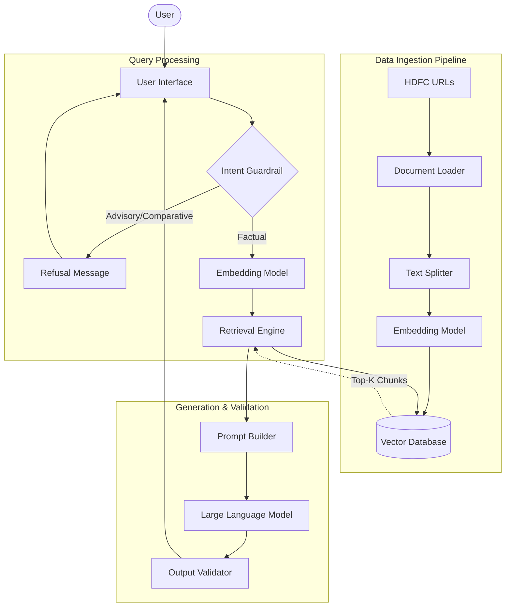
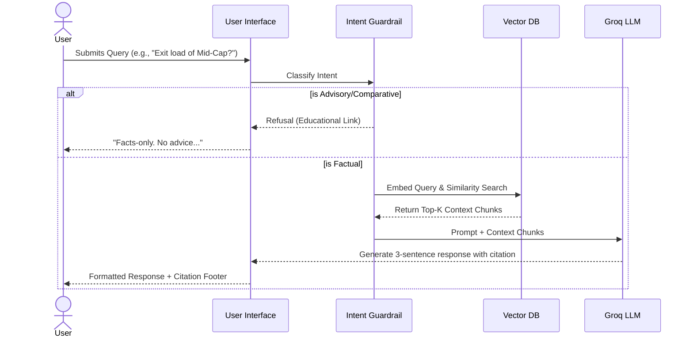

# System Architecture: Mutual Fund FAQ Assistant

This document outlines the technical architecture for the lightweight Retrieval-Augmented Generation (RAG)-based mutual fund assistant described in the `problemstatement.md`.

## 1. High-Level Architecture Overview

The system is built on a standard RAG pattern, separated into three distinct pipelines:
1.  **Data Ingestion Pipeline**: Responsible for fetching, processing, and storing data from the curated corpus.
2.  **Query Processing & Retrieval Pipeline**: Handles user input, classifies intent (for refusal handling), and fetches relevant context.
3.  **Generation & Validation Pipeline**: Generates the final, constraints-bound response and validates it before returning to the user.

## 2. Component Details

### A. Data Ingestion Pipeline
*   **Data Sources**: The 15 specific HDFC mutual fund URLs defined in the scope (including Defence, Gold, Nifty 50, Balanced Advantage, Pharma, Multi Cap, Short Term, Focused, BSE Sensex, Nifty Next 50, Large and Mid Cap, Liquid, Infrastructure, Nifty Top 20, Ultra Short Term).
*   **Scraper / Document Loader**: Uses custom `requests` + `BeautifulSoup` logic to fetch and parse raw HTML content from each Groww URL.
*   **Data Cleaning & Preprocessing**:
    *   Removes HTML boilerplate tags (`<script>`, `<style>`, `<nav>`, `<footer>`, `<header>`, `<aside>`).
    *   Strips Groww-specific UI noise (navigation menus, promotional banners, app download prompts, cookie consent, login/signup CTAs).
    *   Collapses whitespace, removes non-printable/Unicode characters, and normalizes financial symbols (`₹`, `%`, `cr`, `lakh`).
    *   Validates that each URL yields ≥500 characters of meaningful content; logs a warning and skips corrupted extractions.
    *   Saves cleaned text per fund as intermediate `.txt` files in the `data/` directory for debugging and reproducibility.
*   **Text Chunking**: Splits cleaned text into ~1000-character chunks with ~200-character overlap using LangChain's `RecursiveCharacterTextSplitter`.
*   **Metadata Enrichment**: Attaches `source_url`, `fund_name`, and `last_updated` date to every chunk. This is critical for the citation requirement.
*   **Embedding Model**: Converts text chunks into dense vector embeddings using a local open-source HuggingFace model (`all-MiniLM-L6-v2`) for zero-cost, offline embedding generation.
*   **Vector Database**: ChromaDB (persisted locally to `./chroma_db`) to store the embeddings and associated metadata.
*   **Automated Scheduler**: A scheduler component (e.g., cron job or background task) that triggers the data ingestion pipeline daily at 10:00 AM IST to keep the vector database updated with the latest fund data.

### B. Query Processing & Retrieval Pipeline
*   **User Interface**: A modern, lightweight Vite + React single-page application featuring a welcome message, 3 example questions, and the required disclaimer. The React frontend communicates with a Python FastAPI backend via REST API.
*   **Intent Guardrail (Refusal Handling)**: Before querying the knowledge base, a lightweight classifier or a zero-shot prompt determines if the query is:
    *   *Advisory* (e.g., "Should I invest?")
    *   *Comparative* (e.g., "Which is better?")
    *   *Factual* (e.g., "What is the exit load?")
    If classified as advisory or comparative, the pipeline short-circuits and returns a predefined, polite refusal message with an educational link.
*   **Retrieval Engine**: Embeds the valid factual query and performs a similarity search against the Vector Database to fetch the top-k most relevant chunks.

### C. Generation & Validation Pipeline
*   **Prompt Construction**: Dynamically builds the prompt for the LLM. It injects the user's query and the retrieved context chunks. It strictly defines the persona and constraints:
    *   *Persona*: Facts-only mutual fund assistant.
    *   *Constraint 1*: Base answers strictly on provided context.
    *   *Constraint 2*: Maximum 3 sentences.
    *   *Constraint 3*: Include exactly one source link.
*   **Large Language Model (LLM)**: Groq API (`llama-3.3-70b-versatile`) is used as the core generative model, chosen for its ultra-low latency inference. It formulates the concise response based *only* on the prompt context.
*   **Output Formatter/Validator**: Ensures the generated response strictly adheres to formatting rules before sending it to the UI.
    *   Validates sentence count.
    *   Ensures a single citation link is present.
    *   Appends the mandatory footer: `Last updated from sources: <date>`.

## 3. Data Flow

1.  **Offline Phase (Ingestion)**: URLs -> Loader -> Text Chunks -> Embedder -> Vector DB.
2.  **Online Phase (Query)**: User -> UI -> Intent Guardrail -> (If Factual) Embed Query -> Vector DB Search -> Top-K Context -> Prompt Builder -> LLM -> Output Formatter -> UI.

## 4. Security & Compliance Measures
*   **Stateless Architecture**: The backend will not persist user sessions, conversational history across sessions, or personal data (PII like PAN, Aadhaar, OTPs) to comply with privacy requirements.
*   **Prompt Injection Mitigation**: System prompts will be hardened to resist attempts by users to bypass the "no advice" constraints.

## 5. Technology Stack
*   **Framework**: LangChain for orchestrating the RAG pipeline.
*   **Vector Database**: ChromaDB (local, persistent storage).
*   **LLM**: Groq API (`llama-3.3-70b-versatile`) — ultra-fast inference for real-time Q&A.
*   **Embeddings**: HuggingFace `all-MiniLM-L6-v2` — free, local, no API key required.
*   **Frontend**: Vite + React for a modern, responsive chat UI.
*   **Backend API**: FastAPI to expose the RAG pipeline as REST endpoints consumed by the React frontend.
